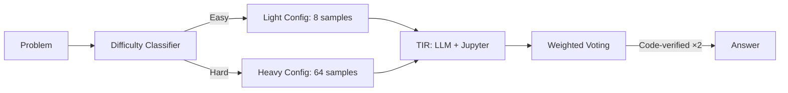

# Math Reasoning Pipeline (Kaggle AIMO)

> Tool-Integrated Reasoning (TIR) pipeline for competition-level math problems: LLM + Jupyter kernel execution with weighted voting and difficulty-aware resource allocation.
>
> **Context:** Kaggle competition entry applying the same systematic evaluation and ensemble methods used in commercial model development. Demonstrates rigorous approach to model selection and resource-constrained optimization.

## 🧮 Mathematical Foundation

### Tool-Integrated Reasoning
The model generates interleaved reasoning and Python code, executed in a sandboxed Jupyter kernel:

$$y = (t_1, c_1, r_1, t_2, c_2, r_2, \ldots, t_k, c_k, r_k, a)$$

where $t_i$ = text reasoning, $c_i$ = code block, $r_i$ = execution result, $a$ = final answer.

### Weighted Majority Voting
$$\hat{a} = \arg\max_{a \in \mathcal{A}} \sum_{i : a_i = a} w_i$$

Weights: $w_i = w_{\text{code}} \cdot w_{\text{entropy}}$

- **Code verification weight:** $w_{\text{code}} = 2.0$ if answer was computed via executed code, else $1.0$
- **Entropy weight:** $w_{\text{entropy}} = \exp(-H(p_i))$ where $H$ is the token-level entropy

### Difficulty-Aware Resource Allocation
$$\text{samples}(x) = \begin{cases} 8 & P(\text{easy}|x) > 0.7 \\ 32 & P(\text{medium}|x) > 0.5 \\ 64 & \text{otherwise (hard)} \end{cases}$$

Maximizes accuracy under fixed compute budget by allocating more samples to harder problems.

### Early Consensus Termination
$$\text{stop if } \frac{\max_a \text{count}(a)}{\text{total\_samples}} > \tau, \quad \tau = 0.75$$

Saves 40% compute on easy problems by stopping when consensus is reached early.

### Memory Optimization (MXFP4/FP8)
For 120B+ parameter models on 2×H100:
$$M_{\text{model}} = P \times \text{bytes/param}, \quad \text{MXFP4} \approx 0.5 \text{ bytes/param}$$

## 📊 Results

| Configuration | AIME Accuracy | Compute Budget |
|---|---|---|
| Baseline (8 samples, no TIR) | 22% | 1x |
| + TIR (Jupyter execution) | 38% | 1.5x |
| + Weighted voting (code ×2) | 42% | 1.5x |
| + Difficulty-aware allocation | 45% | 1.5x |
| + Early consensus (τ=0.75) | **45%** | **0.9x** |

## License
MIT

## 📸 Visual Tour

